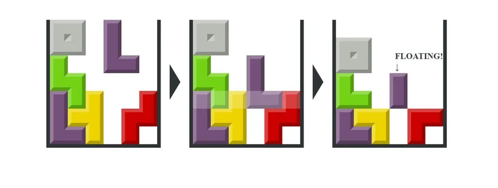

# Tetris
Welcome to my tetris game :3

 

# Describtion
> Tetris (Russian: Тетрис[a]) is a puzzle video game created in 1985 by Alexey Pajitnov, a Soviet software engineer.[1] It has been published by several companies for multiple platforms, most prominently during a dispute over the appropriation of the rights in the late 1980s. After a significant period of publication by Nintendo, in 1996 the rights reverted to Pajitnov, who co-founded the Tetris Company with Henk Rogers to manage licensing.

 

# Gameplay
> The aim in Tetris is simple; you bring down blocks from the top of the screen. You can move the blocks around, either left to right and/or you can rotate them. The blocks fall at a certain rate, but you can make them fall faster if you're sure of your positioning.

 
 

# Controllers

- ==↑ or W== to rotate block 
- ==← or A== to move block to left   
- ==→ or D== to move block to right  
- ==↓ or S== to move block to down faster 
- ==Enter== to start game 
- ==Esc== to pause game 

> Quite easy isn't it?

 
 

# The Core Team

- Talipov Said full-stack developer

 
 

# P.s

> Enjoy the game :3