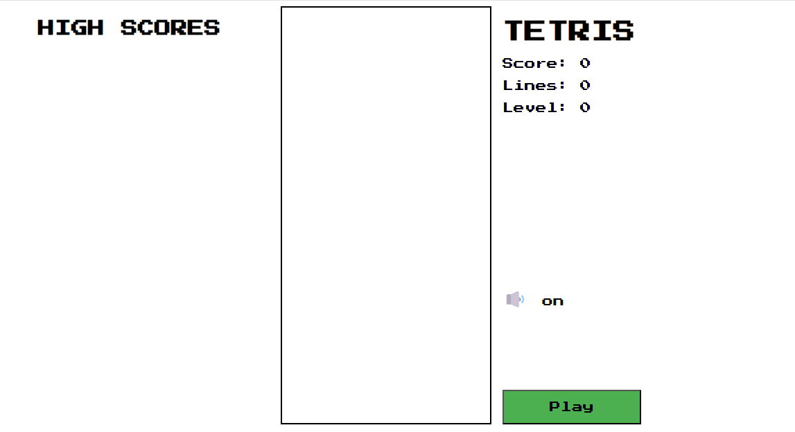

# My Tetris Project

Welcome to the Tetris Game! This project is a classic implementation of the famous Tetris game in JavaScript programming language. Tetris is a tile-matching puzzle game where players aim to complete lines by moving and rotating falling pieces (tetrominoes). The game becomes progressively faster, challenging players to think and react quickly.

## Table of Contents

- [Task](#task)
- [Description](#description)
- [Installation](#installation)
- [Usage](#usage)

## Task

- [x] You will need to create a folder and in this folder will be additional files containing your work.
- [x] Folder names must start with special file names and also contain ( index.html - script.js - style.css ).
- [x] Implement the Tetris game logic and user interface.
- [x] Provide basic game controls for moving, rotating, and dropping Tetris pieces.
- [x] Keep track of the player's score, level, and lines cleared.
- [x] Include a "Play" button to start or restart the game.
- [x] Display the next Tetris piece to be played.
- [x] End the game when the player reaches the top of the board or decides to end the game manually.
- [x] Include a timer to track the player's game duration.

## Description

The goal of Tetris is to clear lines by completing horizontal rows of blocks without leaving any gaps. As the game progresses, the falling pieces (tetrominoes) speed up, making it more challenging. When you complete a line, it disappears, and you earn points. The game ends when the stack of tetrominoes reaches the top of the screen.

### Project Demo

## Installation

1. Clone this repository using `git clone https://github.com/darmanovjakhongir/Full-Stack-My-Tetris.git`.
2. Navigate to the project directory using `cd Full-Stack-My-Tetris`.
3. Open the index.html file in a web browser.

## Usage

- Click the "Play" button to start the game.
- Use the provided buttons to control the Tetris pieces:
  - Rotate: Rotate the current Tetris piece.
  - Left: Move the current Tetris piece to the left.
  - Right: Move the current Tetris piece to the right.
  - Down: Move the current Tetris piece down.
  - Pause: End the game manually.
- The game is over if the player reaches the top of the board.
- The game keeps track of the player's score, level, cleared lines and elapsed time.

## The Core Team

<i>Made at <a href='https://qwasar.io'>Qwasar SV -- Software Engineering School</a></i>

